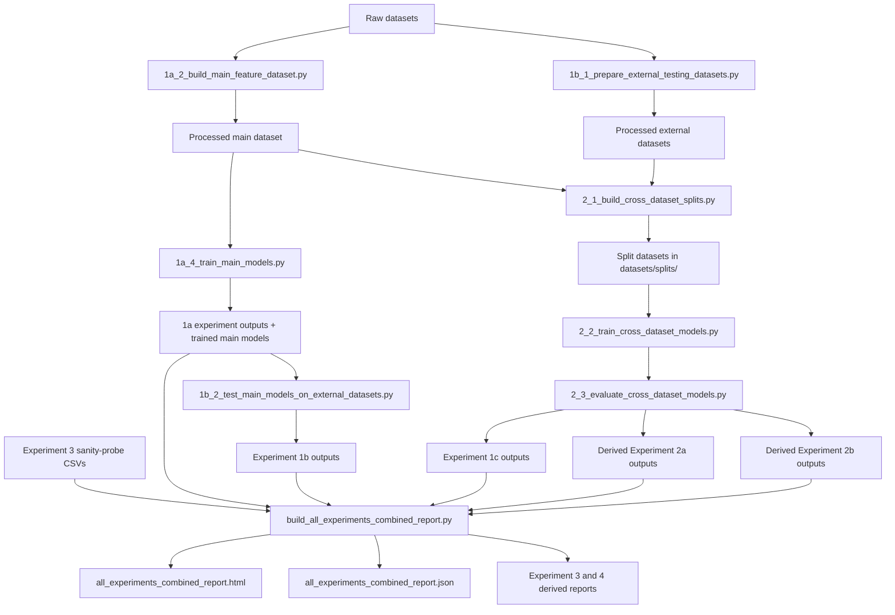

# Machine Learning Workflow

This folder is organised around four things:

- `datasets/`: raw, processed, and split CSV files
- `trained_models/`: saved `.joblib` model files and model metadata
- `scripts/`: runnable workflow scripts plus shared `core/` and `helpers/`
- `experiments/`: experiment-specific summaries and reports

## Simple Tree

```text
machine_learning/
├── datasets/
│   ├── main/
│   ├── external_testing/
│   └── splits/
├── trained_models/
│   ├── 1a_train_on_main_test_on_main/
│   ├── 2_cross_dataset_generalisation/
│   └── interactive/
├── scripts/
│   ├── core/
│   ├── helpers/
│   ├── 1a_1_inspect_main_dataset.py
│   ├── 1a_2_build_main_feature_dataset.py
│   ├── 1a_3_validate_main_feature_dataset.py
│   ├── 1a_4_train_main_models.py
│   ├── 1b_1_prepare_external_testing_datasets.py
│   ├── 1b_2_test_main_models_on_external_datasets.py
│   ├── 2_1_build_cross_dataset_splits.py
│   ├── 2_2_train_cross_dataset_models.py
│   ├── 2_3_evaluate_cross_dataset_models.py
│   ├── train_interactive_model.py
│   ├── test_interactive_model.py
│   └── build_all_experiments_combined_report.py
├── experiments/
│   ├── 1a_train_on_main_test_on_main/
│   ├── 1b_train_on_main_test_on_others/
│   ├── 1c_train_on_other_datasets_test_on_other_datasets/
│   ├── 2a_train_on_each_dataset_test_on_combined/
│   ├── 2b_train_on_combined_test_on_combined/
│   ├── 3_real_world_sanity_probe/
│   └── 4_google_slash_brittleness_check/
├── all_experiments_combined_report.html
└── all_experiments_combined_report.json
```

## Workflow Diagram



## Experiment Map

| Experiment | Purpose | Main scripts | Main outputs |
|---|---|---|---|
| `1a` | Train on main PhiUSIIL and test on main held-out split | `1a_1`, `1a_2`, `1a_3`, `1a_4` | `experiments/1a_train_on_main_test_on_main/` |
| `1b` | Train on main PhiUSIIL and test on external datasets | `1b_1`, `1b_2` | `experiments/1b_train_on_main_test_on_others/` |
| `1c` | Train on external datasets and test on other held-out source datasets | `2_1`, `2_2`, `2_3` | `experiments/1c_train_on_other_datasets_test_on_other_datasets/` |
| `2a` | Train on each single dataset and test on combined held-out set | `2_1`, `2_2`, `2_3` | `experiments/2a_train_on_each_dataset_test_on_combined/` |
| `2b` | Train on combined dataset and test on combined held-out set | `2_1`, `2_2`, `2_3` | `experiments/2b_train_on_combined_test_on_combined/` |
| `3` | 40-URL real-world sanity probe | report builder consumes saved probe CSVs | `experiments/3_real_world_sanity_probe/` |
| `4` | Google trailing-slash brittleness check | report builder derives from Experiment 3 probe outputs | `experiments/4_google_slash_brittleness_check/` |

## Label Rule

Every active workflow in this project uses the same project label meaning:

- `0 = phishing`
- `1 = legitimate`

Important note:

PhishStorm raw labels use the reverse meaning in the original file, so
`1b_1_prepare_external_testing_datasets.py` remaps them during preparation.
